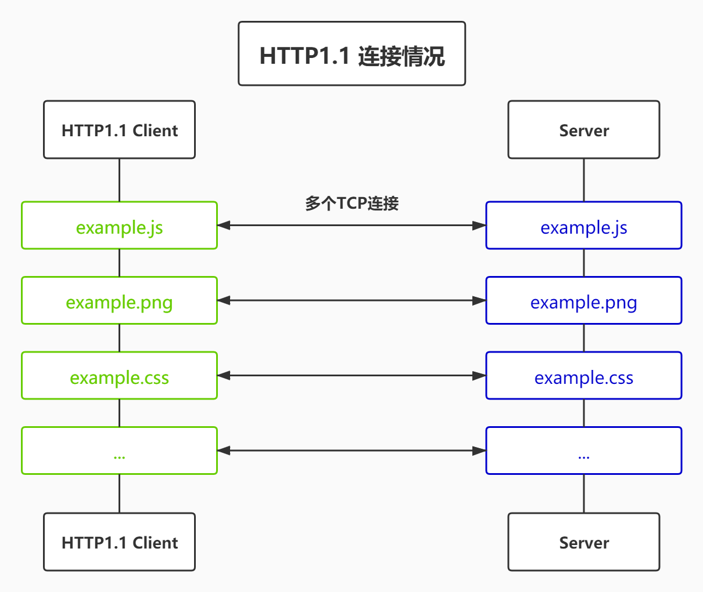
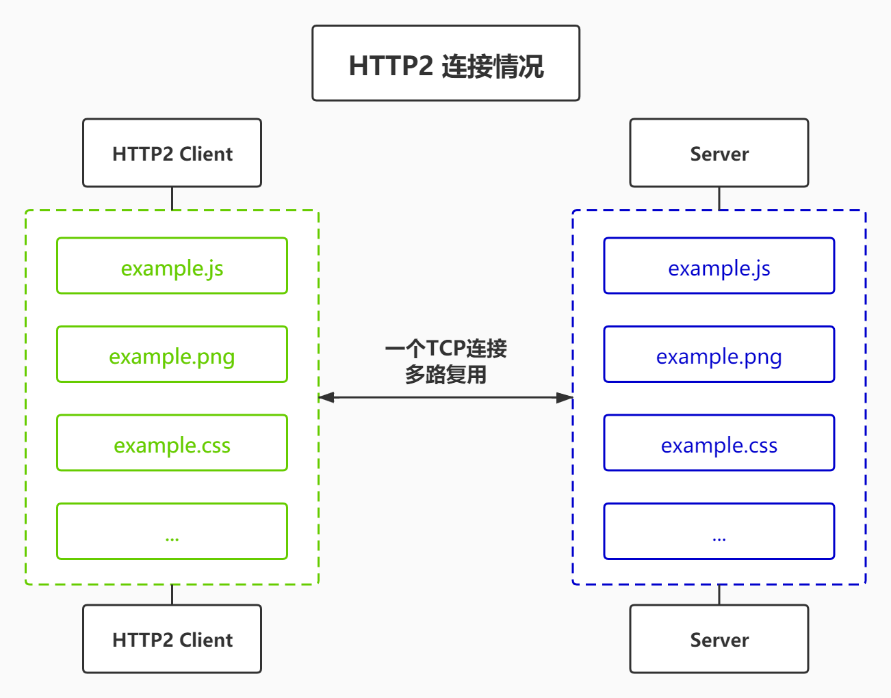

## 什么是 http？

**概念：**

`http` 是一种超文本传输协议，在 `OSI` 模型七层中的第七层**应用层**，也是建立在 `TCP/IP` 之上。和 `TCP/UDP` 协议类似，实际传输数据都需要附加一些**头部数据**。不过与 `TCP/UDP` 不同的是，它是一个“**纯文本**”的协议，所以头数据都是 `ASCII` 码的文本，可以很容易地用肉眼阅读，不用借助程序解析也能够看懂。我们现在最常用的是 `http1.1` 和 `http2` 版本。

**特性：**

- `HTTP` 是灵活可扩展的，可以任意添加头字段实现任意功能；
- `HTTP` 是可靠传输协议，基于 `TCP/IP` 协议“**尽量**”保证数据的送达；
- `HTTP` 是应用层协议，比 FTP、SSH 等更通用功能更多，能够传输任意数据；
- `HTTP` 使用了**请求 - 应答模式**，客户端主动发起请求，服务器被动回复请求；
- `HTTP` 本质上是**无状态**的，每个请求都是互相独立、毫无关联的，协议不要求客户端或服务器记录请求相关的信息（可以借住 `cookie` 达到有状态的效果）

## http 的短连接指的是什么？

`http1.1` 之前都是**短连接**，它底层的数据传输基于 `TCP/IP`，每次发送请求前需要先与服务器建立连接，收到响应报文后会立即关闭连接，频繁的打开和关闭链接服务器压力很大。

## http 的长连接指的是什么？

在第一次请求建立链接后，不关闭。`HTTP/1.1` 中的连接都会**默认**启用长连接。不需要用什么特殊的头字段指定，只要向服务器发送了第一次请求，后续的请求都会重复利用第一次打开的 `TCP` 连接，也就是**长连接**，在这个连接上收发数据。如果服务器支持长连接，它总会在响应报文里放一个“`Connection: keep-alive`”字段。 报文头里如果有“`Connection: close`”就意味着长连接即将关闭；

**过多的长连接会占用服务器资源，所以服务器会用一些策略有选择地关闭长连接；(没研究过，估计也是 LRU 淘汰算法)**

## http 对头阻塞问题指的什么？

**“队头阻塞”** 与短连接 和 长连接无关，而是由 HTTP 基本的 **“请求 - 应答”** 模型所导致的。因为 HTTP 规定报文必须是 **“一发一收”**，这就形成了一个先进先出的 **“串行”** 队列。队列里的请求没有轻重缓急的优先级，只有入队的先后顺序，排在最前面的请求被最优先处理。

**“队头阻塞”** 问题会导致性能下降，可以用 **“并发连接”** 和 **“域名分片”** 技术缓解。

## http2.0 做了哪些改进, http3.0 呢?

**概念：**

> http2 是 http1.1 的下一个版本。http2 对之前版本做了功能上的兼容，由于 HTTPS 已经在安全方面做的非常好了，所以 HTTP/2 的唯一目标就是改进性能。特别要说的是，与 HTTPS 不同，HTTP/2 没有在 URI 里引入新的协议名，仍然用“http”表示明文协议，用“https”表示加密协议。

HTTP/2 的特性包括：

1. 二进制分帧传输： 将请求和响应消息分割为多个二进制帧，可以并发地发送和处理，提高传输效率。
 
2. 多路复用： 在单个连接上可以同时发送多个请求和响应，避免了建立多个 TCP 连接的开销，提高并发性能。 
3. 头部压缩： 使用 HPACK 算法对请求和响应的头部进行压缩，减少数据传输量，提高性能。 
4. 服务器推送： 服务器可以主动推送与当前页面相关的资源，减少客户端的请求延迟。 

而 HTTP/3 则是基于 QUIC 协议的新一代 HTTP 协议。QUIC 是一个基于 UDP 的传输协议，具有以下特性：

1. 连接迁移： 支持在网络切换或设备漫游时无缝迁移连接，避免连接中断。 

2. 无队头阻塞： 解决了 TCP 协议中的队头阻塞问题，可以同时发送多个请求和响应，提高并发性能。 

3. 自定义拥塞控制： 使用独立的拥塞控制算法，适应不同网络条件下的流量控制和拥塞控制。 

4. 前向安全和前向纠错： 支持端到端的加密和纠错机制，提高数据传输的安全性和可靠性。 

总结：HTTP/2 和 HTTP/3 都是在传输层进行的协议改进，HTTP/2 在 TCP 上引入了二进制分帧传输、多路复用、头部压缩和服务器推送等特性，而 HTTP/3 则是基于 UDP 的 QUIC 协议，引入了连接迁移、无队头阻塞、自定义拥塞控制和前向安全和前向纠错等新特性。

## http1.x 长链接 和 http2 多路复用图解对比。

## TCP 的三次握手？

1. 客户端发送 SYN seq=0，状态变为 SYN_SENT
2. 服务端发送 SYN seq=0 ack=1，状态变为 SYN_RCVD
3. 客户端发送 seq=1 ack=1，两端状态都变成已建立连接状态

## 为什么 TCP 建立连接需要三次握手，不是两次或四次?

三次是最少的安全次数，两次不安全，四次浪费资源；
参考文章：https://juejin.cn/post/6844903834708344840?searchId=2024021719035905F7961FC9ED3FF58FB9

## 为什么要四次挥手？

那是因为握手的时候并没有数据传输，所以服务端的 `SYN` 和 `ACK` 报文可以一起发送，但是挥手的时候有数据在传输，所以 `ACK` 和 `FIN` 报文不能同时发送，需要分两步，所以会比握手多一步。

参考文章：https://juejin.cn/post/6844903834708344840?searchId=2024021719035905F7961FC9ED3FF58FB9

## TCP 和 UDP 的区别？

TCP 面向连接（如打电话要先拨号建立连接）提供可靠的服务，UDP 是无连接的，即发送数据之前不需要建立连接，UDP 尽最大努力交付，即不保证可靠交付。

## localhost 和 127.0.0.1 的区别？

`localhost`是本机域名，`127.0.0.1`是本机 IP 地址，本地系统 host 文件，会默认把`localhost`映射到`127.0.0.1`。

## 什么是https?
https并不是http的升级版本，HTTPS（HyperText Transfer Protocol Secure）是HTTP协议的安全版本，用于保护数据传输的安全性和完整性。在HTTPS中，通过使用SSL（Secure Socket Layer）或TLS（Transport Layer Security）协议来加密和解密通信数据，从而保证通信过程中数据不被窃取或篡改。

## https的工作原理？

1. 客户端发起HTTPS请求
2. 服务端响应HTTPS请求，发送证书
3. 客户端验证证书，生成会话密钥
4. 客户端使用会话密钥加密请求数据
5. 服务端使用会话密钥解密请求数据
6. 服务端使用会话密钥加密响应数据
7. 客户端使用会话密钥解密响应数据

## http 和 https 的默认端口分别是什么？

http 是 80，https 是 443。

## http 和 https 的区别？

https://www.iamshuaidi.com/1926.html

1.数据传输安全：HTTPS使用SSL/TLS协议加密数据传输，保证数据传输的安全性和完整性。

2.认证用户和服务器：HTTPS使用数字证书对网站进行身份验证，防止中间人攻击。

3.搜索引擎排名更高：Google等搜索引擎在搜索排名时更倾向于优先考虑HTTPS站点。

## 什么是 SSL/TLS 协议？

https://www.iamshuaidi.com/1959.html

## 什么是 URI，其结构是什么？

**概念**： 是用来唯一标记服务器上资源的一个字符串，通常也称为 `URL`；

**结构**: 通常由 `scheme`、`host:port`、`path` 和 `query`、`hash` 等部分组成，有的可以省略；

## 域名等级划分有哪些？

## GET 和 POST 的区别？

## HTTP 常见的状态码有哪些？

**1. `1xx` 类状态码属于提示信息，是协议处理中的一种中间状态，实际用到的比较少。**

**2. `2xx` 类状态码表示服务器成功处理了客户端的请求，也是我们最愿意看到的状态。**

- 「200 OK」是最常见的成功状态码，表示一切正常。如果是非 HEAD 请求，服务器返回的响应头都会有 body 数据。

- 「204 No Content」也是常见的成功状态码，与 200 OK 基本相同，但响应头没有 body 数据。

- 「206 Partial Content」是应用于 HTTP 分块下载或断点续传，表示响应返回的 body 数据并不是资源的全部，而是其中的一部分，也是服务器处理成功的状态。

**3. `3xx` 类状态码表示客户端请求的资源发生了变动，需要客户端用新的 URL 重新发送请求获取资源，也就是重定向。**

- 「301 Moved Permanently」表示永久重定向，说明请求的资源已经不存在了，需改用新的 URL 再次访问。

- 「302 Found」表示临时重定向，说明请求的资源还在，但暂时需要用另一个 URL 来访问。

- 301 和 302 都会在响应头里使用字段 Location，指明后续要跳转的 URL，浏览器会自动重定向新的 URL。

- 「304 Not Modified」不具有跳转的含义，表示资源未修改，重定向已存在的缓冲文件，也称缓存重定向，也就是告诉客户端可以继续使用缓存资源，用于缓存控制。

**4. `4xx` 类状态码表示客户端发送的报文有误，服务器无法处理，也就是错误码的含义。**

- 「400 Bad Request」表示客户端请求的报文有错误，但只是个笼统的错误。

- 「403 Forbidden」表示服务器禁止访问资源，并不是客户端的请求出错。

- 「404 Not Found」表示请求的资源在服务器上不存在或未找到，所以无法提供给客户端。

**5. `5xx` 类状态码表示客户端请求报文正确，但是服务器处理时内部发生了错误，属于服务器端的错误码。**

- 「500 Internal Server Error」与 400 类型，是个笼统通用的错误码，服务器发生了什么错误，我们并不知道。

- 「501 Not Implemented」表示客户端请求的功能还不支持，类似“即将开业，敬请期待”的意思。

- 「502 Bad Gateway」通常是服务器作为网关或代理时返回的错误码，表示服务器自身工作正常，访问后端服务器发生了错误。

- 「503 Service Unavailable」表示服务器当前很忙，暂时无法响应客户端，类似“网络服务正忙，请稍后重试”的意思。

## HTTP 常见字段有哪些？

- Content-Type:  字段用于服务器回应时，告诉客户端，本次数据是什么格式。`Content-Type: text/html; Charset=utf-8`

- Accpet:  同上，客户端请求的时候，可以使用 Accept 字段声明自己可以接受哪些数据格式。`Accept: */*`

- Content-Encoding:  字段说明数据的压缩方法。表示服务器返回的数据使用了什么压缩格式。`Content-Encoding: gzip`

- Accept-Encoding:  同上，客户端在请求时，用 Accept-Encoding 字段说明自己可以接受哪些压缩方法。`Accept-Encoding: gzip, deflate`

- Connection:  字段最常用于客户端要求服务器使用 HTTP 长连接 机制，以便其他请求复用。
- User-Agent:  浏览器的身份标识字符串
- Cookie:  服务器通过 Set-Cookie 设置的一个 HTTP 协议 Cookie
- Cache-Control:  用来指定当前的请求/回复中的，是否使用缓存机制。
- Authorization:  用于表示 HTTP 协议中需要认证资源的认证信息.

## 为什么利用多个域名来存储网站资源会更有效？

利用多个域名来存储网站资源可以带来以下好处：

- CDN 缓存更方便：内容分发网络（CDN）可以更轻松地缓存和分发位于不同域名下的资源，提高资源的访问速度和可用性。
- 突破浏览器并发限制：大多数浏览器对同一域名下的并发请求数量有限制，通过将资源分布在多个域名下，可以突破这一限制，同时发送更多的并发请求，加快页面加载速度。
- 节约 cookie 带宽：浏览器在每个请求中都会携带相应域名下的 cookie 信息，通过将资源分布在不同的域名下，可以减少对 cookie 的传输，节约带宽和提高性能。
- 节约主域名的连接数：浏览器对同一域名下的连接数也有限制，通过将资源请求分散到多个域名下，可以减少对主域名的连接数占用，提高页面的响应速度和并发处理能力。
- 防止不必要的安全问题：将静态资源与主要网站内容分离到不同的域名下，可以降低恶意攻击者利用资源加载过程中的安全漏洞对主站点进行攻击的风险。

综上所述，通过利用多个域名来存储网站资源，可以提升网站的性能、安全性和用户体验。

## fetch 发送 2 次请求的原因？

当使用 fetch 发送 POST 请求时，会先发送一个 OPTION 请求进行预检查，用来获知服务端是否允许该跨域请求，服务器确认允许之后会返回 204 状态码，表示允许该跨域请求，这时才发起实际的 HTTP 请求。在预检请求的返回中，服务器端也可以通知客户端，是否需要携带身份凭证（包括 Cookies 和 HTTP 认证相关数据）

