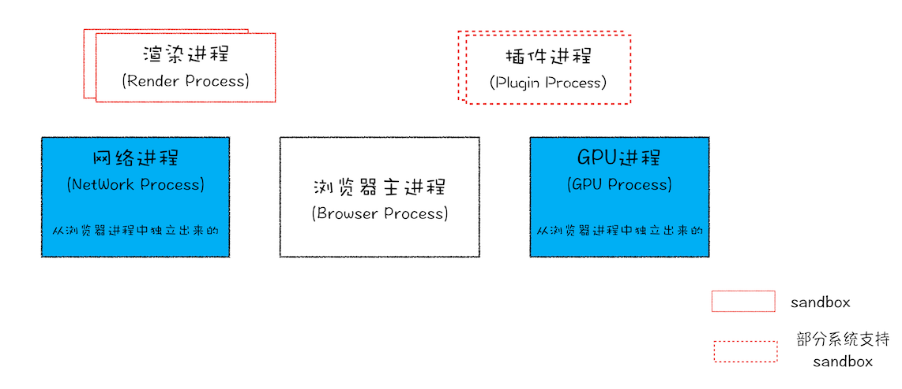
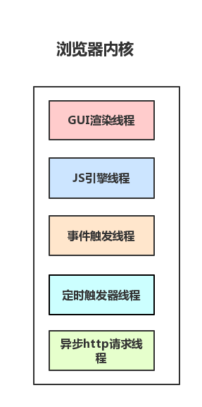

tip
大部分都是围绕 `chromium`内核 浏览器来说，面试也是基于这个内核去问。

## Chrome、Chromium、V8 分别是什么？

**Chromium**

`Chromium`是谷歌的开源项目，我们平时说的基于 **谷歌浏览器内核** 的浏览器其实说的是基于`Chromium`内核来开发自己的浏览器。更多面向的是 开发人员。

**Chrome**
`Chrome`是谷歌对外的浏览器，不是开源的，面向的是普通用户、开发人员。

**V8**
[Chrome V8 引擎介绍](https://blog.csdn.net/fuhanghang/article/details/112859503)

`chrome v8` 也可以简单的说成`v8`, 是一个开源的 `javascript` 引擎, 它是由谷歌 `Chromium` 项目团队开发, 应用在 `chrome` 和基于 `chromium` 浏览器上. 这个项目由 Lars Bak 创建. `V8` 引擎的第一个版本发行时间和 `Chrome` 的第一个版本发行时间是一样的: 2008 年 9 月 2 号. 它同样也用在 Couchbase, MongoDB 和 node.js 上.

`V8` 在执行 `javascript` 之前, 会将 `javascript` 编译成本地机器代码, 来代替更多的传统技术, 比如解释字节码或者编译整个应用程序到机器码, 且从一个文件系统执行它. 编译代码是在运行时动态的优化, 基于代码执行情况的启发式方式. 优化技术的使用包含 inlining, 消耗运行时性能的 elision, 还有 inline caching.

V8 可以编译成 x86, ARM 或者 MIPS 指令设置结构的 32 位或者 64 位版本; 同样他也被安装在 PowerPC 和 IBM s390 服务器上.

[参考文章](https://juejin.cn/post/6914479519394955271#heading-3)
[参考文章](https://github.com/webfansplz/article/issues/39)

## 进程 和 线程的区别？

**进程: ** 进程是 `CPU` **资源分配** 的最小单位（是能拥有资源和独立运行的最小单位）。

**线程：** 线程是 `CPU` **调度** 的最小单位（是建立在进程基础上的一次程序运行单位）。

**区别：**

- 进程和线程都可以实现并发执行，但进程是独立的执行实体，而线程是依赖于进程的。

- 进程之间资源相互隔离，线程共享所属进程的资源。

- 创建和销毁线程的开销较小，而创建和销毁进程的开销较大。

- 多线程程序的编程复杂度通常比单线程程序高，但多线程可以更好地利用多核处理器来提高程序的执行效率。

## 浏览器都有哪些进程？

**浏览器主进程：**

- 主要负责**界面显示**、**用户交互**、**子进程管理**，同时提供**存储**等功能。

** 渲染进程：**

- 核心任务是将 `HTML`、`CSS` 和 `JavaScript` 转换为用户可以与之交互的网页，排版引擎 `Blink` 和 `JavaScript` 引擎 `V8` 都是运行在该进程中，默认情况下，`Chrome` 会为每个 `Tab` 标签创建一个**渲染进程**。出于安全考虑，**渲染进程** 都是运行在**沙箱模式下**。

** GPU 进程：**

- 其实，`Chrome` 刚开始发布的时候是没有 `GPU` 进程的。而 `GPU` 的使用初衷是为了实现 `3D CSS` 的效果，只是随后网页、`Chrome` 的 `UI` 界面都选择采用 `GPU` 来绘制，这使得 `GPU` 成为浏览器普遍的需求。最后，`Chrome` 在其多进程架构上也引入了 **GPU 进程**。

** 网络进程：**

- 主要负责页面的**网络资源加载**，之前是作为一个模块运行在浏览器进程里面的，直至最近才独立出来，成为一个单独的进程。

** 插件进程：**

- 主要是负责插件的运行，因插件易崩溃，所以需要通过插件进程来隔离，以保证插件进程崩溃不会对浏览器和页面造成影响。

## 渲染进程有哪些线程？

**平时我们说的 浏览器是多线程的指得是，浏览器中的 渲染进程 是多线程的**

**1. GUI 渲染线程**

- 负责渲染浏览器界面,解析 `HTML`,`CSS`,构建 `DOM` 树和 `RenderObject` 树,布局和绘制等。

- 当界面需要重绘（`Repaint`）或由于某种操作引发回流(`reflow`)时,该线程就会执行。

- 注意,GUI 渲染线程 与 JS 引擎线程是互斥的,当 JS 引擎执行时 GUI 线程会被挂起（相当于被冻结了）,`GUI` 更新会被保存在一个队列中等到 `JS 引擎`空闲时立即被执行。

**2. JS 引擎线程（V8 引擎）**

- `Javascript` 引擎,也称为 `JS` 内核,负责处理 `Javascript` 脚本程序。（例如 V8 引擎）

- JS 引擎线程 负责解析 `Javascript` 脚本,运行代码。

- JS 引擎一直等待着任务队列中任务的到来,然后加以处理,一个 Tab 页（renderer 进程）中无论什么时候都只有一个 JS 线程在运行 JS 程序, 这就是我们平时说的 JS 是单线程的

- 注意,GUI 渲染线程与 JS 引擎线程是互斥的,所以如果 JS 执行的时间过长,这样就会造成页面的渲染不连贯,导致页面渲染加载阻塞。

**3. 事件触发线程（事件循环）**

- 平时我们说的`event loop` 归属于**浏览器**而不是 **JS 引擎**, 用来控制事件循环（可以理解,JS 引擎自己都忙不过来,需要浏览器另开线程协助）

- 当 JS 引擎执行代码块如 `setTimeOut` 时（也可来自浏览器内核的其他线程,如鼠标点击、AJAX 异步请求等）,会将对应任务添加到**事件线程**中。

- 当对应的事件符合触发条件被触发时,该线程会把事件添加到待处理队列的队尾,等待 **JS 引擎**的处理

- 注意,由于 JS 的单线程关系,所以这些待处理队列中的事件都得排队等待 JS 引擎处理（当 JS 引擎空闲时才会去执行）

**4. 定时触发器线程**

- 传说中的 `setInterval` 与 `setTimeout` 所在线程

- 浏览器定时计数器并不是由 JavaScript 引擎计数的,（因为 JavaScript 引擎是单线程的, 如果处于阻塞线程状态就会影响记计时的准确）

- 因此通过单独线程来计时并触发定时（计时完毕后,添加到事件队列中,等待 JS 引擎空闲后执行）

- 注意,W3C 在 HTML 标准中规定,规定要求 setTimeout 中低于 4ms 的时间间隔算为 4ms。

**5. 异步 http 请求线程**

- 在 `XMLHttpRequest` 在连接后是通过浏览器新开一个线程请求。

- 将检测到状态变更时,如果设置有回调函数,异步线程就产生状态变更事件,将这个回调再放入事件队列中。再由 `JavaScript` 引擎执行。

## 浏览器为什么要区分微任务和宏任务？

`为了插队。`

一个 Event Loop，Microtask 是在 Macrotask 之后调用，Microtask 会在下一个 Event Loop 之前执行调用完，并且其中会将 Microtask 执行当中新注册的 Microtask 一并调用执行完，然后才开始下一次 Event loop，所以如果有新的 Macrotask 就需要一直等待，等到上一个 Event loop 当中 Microtask 被清空为止。由此可见， 我们可以在下一次 Event loop 之前进行插队。如果不区分 Microtask 和 Macrotask，那就无法在下一次 Event loop 之前进行插队，其中新注册的任务得等到下一个 Macrotask 完成之后才能进行，这中间可能你需要的状态就无法在下一个 Macrotask 中得到同步。状态的同步对于视图来说至关重要，这也就牵扯到了为什么 javascript 是单线程的原因所在。

## 为什么 JS 是单线程的？

其实上面已经说过了，如果 `JavaScript` 是多线程的方式来操作这些 `UI DOM`,则可能出现 `UI` 操作的冲突。当然我们可以通过 锁 来解决上面的问题。但为了避免因为引入了 锁 而带来更大的复杂性,`Javascript` 在最初就选择了单线程执行。

> 想下 浏览器渲染进程 架构的 五个 线程，会帮 JS 引擎线程 解决单线程带来的问题。

## JS 会阻塞页面渲染吗？

会的，参考上边 **JS 引擎线程** 和 **GUI 渲染线程** 互斥

## CSS 会阻塞页面渲染吗？

**会的！！**

**DOM 解析** 和 **CSS 解析**是并行的, 所以 **CSS 加载不会阻塞 DOM 的解析(在没有 JS 脚本的情况下)**。
然而,由于 `Render Tree`(渲染树) 是依赖于 `DOM Tree` 和 `CSSOM Tree` 的, 所以他必须等待到 `CSSOM Tree` 构建完成,也就是 `CSS` 资源加载完成(或者 `CSS` 资源加载失败)后,才能开始渲染。因此,**CSS 加载会阻塞 DOM 的渲染**

## DOMContentLoaded 与 load 的区别？

**load**

- 当整个页面及**所有依赖资源**都已完成加载时，将触发 `load` 事件。

**DOMContentLoaded**

- 仅当 `DOM` 解析完成后, 不包括样式表, 图片，会触发 `DOMContentLoaded` 事件

## script 标签中的 defer 和 async 的区别？

- **defer 并行加载 js 文件，会按照页面上 script 标签的顺序执行**
- **async 并行加载 js 文件，下载完成立即执行，不会按照页面上 script 标签的顺序执行**

**defer**

- `defer` 延迟属性可以使浏览器不需要等待脚本的下载，浏览器会继续处理 html 构建 DOM，直到完全构建完 DOM 后才会执行脚本。就是总是在 DOM 构建完之后才会执行，在 `DOMContentLoaded` 事件之前执行。

- `defer` 脚本保持相对顺序来执行，就像常规脚本一样。多个 `defer` 脚本会并行下载，但执行的时候会按照顺序执行。

- `webpack` 打包后 `htmlWabpackPlugin` 会默认生成为 `defer` 脚本引入 `bundle。`

**async**

- `async` 异步加载脚本，不会阻塞页面渲染。
- `DOMContentLoaded` 可能发生在 `async` **之前** 或 **之后**
- `async` 加载脚本完脚本会立即执行，可以在 `DOM` 尚未完全下载完成就加载和执行。
- 一般将没有依赖的独立的第三方脚本设置成 `async`

## 图片/视频/字体会阻塞页面渲染嘛？

不会阻塞 `DOM` 的解析 和 渲染，并且不会影响 `DOMContentLoaded` 事件的触发，当图片/视频等加载完成后才会触发 `load` 事件。

## 回流 和 重绘 的区别？

**回流(Reflow)**

- 当 `Render Tree` 中部分或全部元素的尺寸、结构、或某些属性发生改变时, 浏览器重新渲染部分或全部文档的过程称为**回流**。

**重绘(Repaint)**

- 当页面中元素样式的改变并不影响它在文档流中的位置时（例如：`color`、` background-color``、visibility ` 等）,浏览器会将新样式赋予给元素并重新绘制它,这个过程称为**重绘**。

**注意：回流必将引起重绘, 重绘不一定会引起回流。**

## 页面渲染流程/原理(重点)？

1. 解析 `html` 文件，构建 `DOM` 树，这期间也有对 `JS` 脚本的下载和 `CSS` 的下载。下载 `CSS` 和构建 `DOM` 是并行的。

2. `CSS` 文件下载完成,解析 `CSS` 文件生成树形的数据结构（`CSSOM`）,然后结合 `DOM` 树合并成 `RenderObject`（渲染） 树。

3. 然后会对 `RenderObject` 树进行 **布局**, 进行元素尺寸、位置等计算。

4. 然后会对 `RenderObject` 树进行 **绘制**, 绘制页面的像素信息。

5. 浏览器主进程将默认的图层和复合图层交给 `GPU` 进程,`GPU` 进程再将各个图层合成（composite）,最后显示出页面。

## 从输入 URL 到页面展示的过程(重点)？

https://segmentfault.com/a/1190000041553527

> 这个问题，虽然问烂了，但考察的知识点特别多，能回答到什么程度，就看知识覆盖面了。 比如输入www.baidu.com

**`1. URL 解析(编码)` -- 浏览器主进程**

- 会检查 `url` 的拼写
  - 如果是 文本，则拼接成默认搜索引擎加关键字的 `URL` 进行搜索
  - 如果是 URL 就进行页面访问请求，并加上协议头（http、https）

**`2. 检查缓存`**

**`2. DNS 解析` -- 网络进程**

因为浏览器不能直接通过域名找到对应的服务器 `IP` 地址，所以需要进行 `DNS` 解析，查找到对应的 `IP` 地址进行访问。

- (1) 先检查本地的 `hosts` 文件中，是否有这个网址记录，有则从记录里面找到对应的 `IP` 地址，完成域名解析。
- (2) 如果本地`hosts`文件没有映射，去查找 本地**dns 解析器**是否有缓存, 又就返回。
- (3) 然后去我们配置的 **dns 服务器上** 查看是否有或者 是否有缓存， 有就返回。
- (4) 还没有的话就去找根 DNS 服务器(全球 13 台，固定 ip 地址)，然后判断`.com`域名是哪个服务器管理，如果无法解析，就查找`.baidu.com`服务器是否能解析，直到查到`www.baidu.com`的`IP`地址。

**`3. 建立 TCP 连接` -- 网络进程**

- 通过三次握手

  1. 客户端发送 `SYN 包（seq = j）`到服务器，并进入 `SYN_SEND` 状态，等待服务器确认。

  2. 服务器收到 SYN 包，必须确认客户的 `SYN（ACK = k + 1）`，同时自己也发送一个 `SYN 包（seq = k）`，即 `SYN+ACK` 包，此时服务器进入 `SYN_RECV` 状态。

  3. 客户端收到服务器的 `SYN+ACK` 包，向服务器发送确认包 `ACK（ACK = k + 1）`，此包发送完毕，客户端和服务器进入 `ESTABLISHED` 状态，完成三次握手。

**`4. 发送HTTP/HTTPS请求` -- 网络进程**

- 如果是 `http` 协议，则直接`构建/发送`请求头信息。

- 如果是 `https` 协议，会在 `TCP` 与 `HTTP` 之间多添加一层协议做加密及认证的服务, HTTPS 使用 `SSL`（Secure Socket Layer） 和 `TLS`（Transport Layer Security） 协议，保障了信息的安全。

**`5. 服务器响应请求` -- 网络进程**

- 服务器收到请求后，将发回一个 HTTP `响应报文`，内容包括相关响应头和 HTML 正文。

- 检查状态码，如果是`301/302`，则需要重定向，需要重复上面步骤。

- 状态码如果是`304` 这种就读取缓存。

- 状态吗，如果是`200`，则检查响应类型`Content-Type`，如果是`字节流类型`，则将该请求提交给`下载管理器`，该导航流程结束，不再进行后续的渲染，如果是`html`则通知浏览器进程准备渲染进程准备进行渲染。

**`6. 浏览器解析渲染页面` -- 渲染进程**

**参考页面渲染原理**

`7. TCP断开连接(默认是keep-alive)`

现在的页面为了优化请求的耗时，默认都会开启持久连接`（keep-alive）`，那么一个 TCP 连接确切关闭的时机，是这个 tab 标签页关闭的时候。这个关闭的过程就是`四次挥手`。关闭是一个全双工的过程，发包的顺序是不一定的。

## 浏览器渲染优化有哪些手段？

**优化 JavaScript**

- `JavaScript`会阻塞 HTML 的解析 将`JavaScript`放到 `body` 最后面

- 尽量使用异步加载`JS`资源，这样不会阻塞`DOM`解析，如`defer`、`async`

**优化 CSS 加载**

- `CSS`样式少，使用内嵌样式
- 导入外部样式使用`link`，而不是`@import`，因为它会阻塞渲染。

**减少回流重绘**

- 避免频繁操作样式
- 避免频繁操作 DOM
- 复杂动画使用定位脱离文当流
- 使用 transform 替代动画

