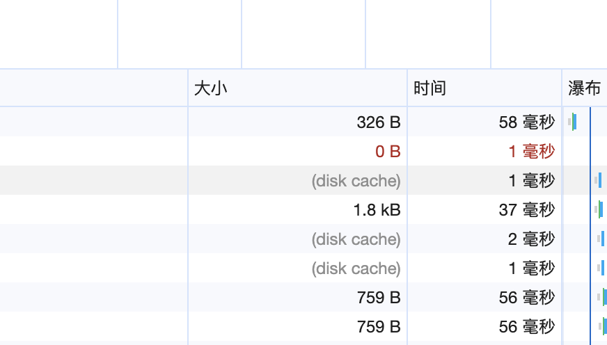

## HTTP 缓存划分？

1. 按照 **失效策略** 划分为：

- 强缓存
- 协商缓存

2. 按照 **缓存位置** 划分可以分为：

- Service Worker Cache
- Memory Cache
- Disk Cache
- Push Cache

3. 按照 **存储型** 划分为：

- Cookie
- Web Storage
- IndexedDB 等

## 强缓存 和 协商缓存涉及到的 首部(头)字段有哪些?

**====强缓存====**

> 涉及首部字段为：**Expires** 和 **Cache-Control**。

**Expires**

`Expires` 首部字段是 `HTTP/1.0` 中定义缓存的字段，其给出了缓存过期的绝对时间，即在此时间之后，响应资源过期，属于实体首部字段。

**示例**: `Expires: Wed, 11 May 2022 03:50:47 GMT`

上述示例表示该资源将在以上时间之后过期，而在该时间之前浏览器可以直接从浏览器缓中读取数据，无需再次请求服务器。注意这里无需再次请求服务器便是**命中了强缓存**。

但是因为 `Expires` 设置的缓存过期时间是一个绝对时间，所以会受客户端时间的影响而变得不精准。

**Cache-control**  
`Cache-Control` 首部字段是 `HTTP/1.1` 中定义缓存的字段，其用于控制缓存的行为，可以组合使用多种指令，多个指令之间可以通过 “,” 分隔，属于通用首部字段。常用的指令有：`max-age`、`s-maxage`、`public/private`、`no-cache/no-store` 等。

如：
`Cache-Control: max-age:3600 s-maxage=3600, public Cache-Control: no-cache`

- **max-age**: 指令给出了缓存过期的相对时间，单位为秒数。当其与 `Expires` 同时出现时，`max-age` 的优先级更高。但往往为了做向下兼容，两者都会经常出现在响应首部中。同时 `max-age` 还可在请求首部中被使用，告知服务器客户端希望接收一个存在时间（age）不大于多少秒的资源。
- **s-max-age**: 其只适用于公共缓存服务器，比如资源从源服务器发出后又被中间的代理服务器接收并缓存。当使用 `s-maxage` 指令后，公共缓存服务器将直接忽略 `Expires` 和 `max-age` 指令的值。
- **publick**: 指令表示该资源可以被任何节点缓存（包括客户端和代理服务器）。
- **private**: 表示该资源只提供给客户端缓存，代理服务器不会进行缓存。同时当设置了 `private` 指令后 `s-maxage` 指令将被忽略。
- **no-store**: 不进行任何缓存。
- **no-cache**: 在请求首部中被使用时，表示告知（代理）服务器不直接使用缓存，要求向源服务器发起请求，而当在响应首部中被返回时，表示客户端可以缓存资源，但每次使用缓存资源前都必须先向服务器确认其有效性，这对每次访问都需要确认身份的应用来说很有用。

**====协商缓存===**

**协商缓存可以看作是强制缓存失效后，浏览器携带缓存标识向服务器发起请求，由服务器根据缓存标识决定是否使用缓存的过程**

> **Last-Modified** 和 **If-Modified-Since**

`Last-Modified` 首部字段顾名思义，代表资源的最后修改时间，其属于响应首部字段。当浏览器第一次接收到服务器返回资源的 `Last-Modified` 值后，其会把这个值存储起来，并再下次访问该资源时通过携带 `If-Modified-Since` 请求首部发送给服务器验证该资源有没有过期。

示例:

`Last-Modified: Fri , 14 May 2021 17:23:13 GMT`  
`If-Modified-Since: Fri , 14 May 2021 17:23:13 GMT`

如果在 `If-Modified-Since` 字段指定的时间之后资源发生了更新，那么服务器会将更新的资源发送给浏览器（状态码 200）并返回最新的 `Last-Modified` 值，浏览器收到资源后会更新缓存的 `If-Modified-Since` 的值。

如果在 `If-Modified-Since` 字段指定的时间之后资源都没有发生更新，那么服务器会返回状态码 `304 Not Modified` 的响应。

> **Etag** 和 **If-None-Match**

示例

`Etag: "29322-09SpAhH3nXWd8KIVqB10hSSz66"`  
`If-None-Match: "29322-09SpAhH3nXWd8KIVqB10hSSz66"`

如果服务器发现 `If-None-Match` 值与 `Etag` 不一致时，说明服务器上的文件已经被更新，那么服务器会发送更新后的资源给浏览器并返回最新的 `Etag` 值，浏览器收到资源后会更新缓存的 `If-None-Match` 的值。

## 如何生成强缓存、命中强缓存？

**生成过程：**

当浏览器发起 HTTP 请求时，会向浏览器缓存进行一次询问，若浏览器缓存没有该资源的缓存数据，那么浏览器便会向服务器发起请求，服务器接收请求后将资源返回给浏览器，浏览器会将资源的响应数据存储到浏览器缓存中，这便是**强缓存的生成过程**

**命中过程：**

强缓存生成后，第二次访问该资源，就可以从缓存中拿到该资源，期间**不需要与服务器交互**。 会看到浏览器开发者工具中，资源的 `size`字段为 `Disk cache (磁盘缓存)` 或 `Memory Cache（内存缓存）` 这就是**命中强缓存**，其中 **memory Cache** 比 **disk cache** 更快，快到不需要时间。

> **注意：强缓存设置的 Expires(绝对日期) 和 max-age(相对时间) 都会收到客户端时间设置的影响**

## 如何生成协商缓存、命中协商缓存？

**协商缓存就是与服务端协商之后，通过协商结果来判断是否使用本地缓存。**

协商缓存可以基于两种头部来实现。

**第一种(基于修改时间)：** 请求头部中的 `If-Modified-Since` 字段与响应头部中的 `Last-Modified` 字段实现，这两个字段的意思是：

响应头部中的 `Last-Modified`：标示这个响应资源的最后修改时间；

请求头部中的 `If-Modified-Since`：当资源过期了，发现响应头中具有 `Last-Modified` 声明，则再次发起请求的时候带上 `Last-Modified` 的时间，服务器收到请求后发现有 `If-Modified-Since` 则与被请求资源的最后修改时间进行对比（`Last-Modified`），如果最后修改时间较新（大），说明资源又被改过，则返回最新资源，HTTP 200 OK；如果最后修改时间较旧（小），说明资源无新修改，响应 HTTP 304 走缓存。

**第二种(基于修改内容)：** 请求头部中的 `If-None-Match` 字段与响应头部中的 `ETag` 字段，这两个字段的意思是：

响应头部中 `Etag`：唯一标识响应资源；

请求头部中的 `If-None-Match`：当资源过期时，浏览器发现响应头里有 `Etag`，则再次向服务器发起请求时，会将请求头 `If-None-Match` 值设置为 `Etag` 的值。服务器收到请求后进行比对，如果资源没有变化返回 304，如果资源变化了返回 200。

> **注意：Etag 的优先级 要高于 Last-Modified, 协商缓存这两个字段都需要配合强制缓存中 Cache-Control 字段来使用，只有在未能命中强制缓存的时候，才能发起带有协商缓存字段的请求**

## 谈谈你项目中是如何使用缓存的（缓存策略）？

现在项目都是 SPA 单页应用，在浏览器缓存层面上，使用**强缓存**和**协商缓**存配合使用。

- **频繁变动的资源，比如 HTML， 采用协商缓存。**
- **CSS、JS、图片资源等采用强缓存，使用 hash 命名。**

其中我们现在都使用 webpack、vite 等打包工具，在打包的时候会给资源文件名生成 hash。拿 webpack 举例：

**1. hash**

`hash` 属于项目级别的 `hash`，意思就是整个项目中只要有文件改变该 `hash` 值就会变化，同时所有文件也都共用该 `hash` 值。最终打包输出的资源文件名 `hash` 值都一样，按照缓存策略进行分析，浏览器加载所有资源都将重新请求服务器，导致没有改动资源的加载浪费，因此不建议在项目中采用这种方式进行构建。

**2. chunkhash**

`chunkhash` 与 `hash` 不同，其属于入口文件级别的 `hash`，会根据入口文件（entry）的依赖进行打包，同时为了避免一些公共库、插件被打包至入口文件中，我们可以借助 `CommonsChunkPlugin` 插件进行公共模块的提取。 **公共模块一般除了升级版本外永远不会改动，我们希望浏览器能够将其存入强缓存中，不受其他业务模块的修改导致文件 chunkhash 名称变动的影响。**

**2. contenthash**

`contenthash` 是属于文件内容级别的 hash，其会根据文件内容的变化而变化。一般用于解决某个 js 中引用了其他资源 css，当 js 修改了会改变`chunkhash`, 同时 css 的 `chunkhash`也会被修改。所以这时候一般会把 css 的 hash 设置为 `contenthash`即可。

**总结：将 chunkhash 和 contenthash 组合使用才能最大化的利用 HTTP 缓存中强缓存的优势，减少不必要的资源重复请求，提升网页的整体打开速度。**

## CDN 是什么？

## cookie、localStorage、sessionStorage 的区别？

Cookie 的存储空间很小，不能超过 4KB，因此这一缺点也限制了它用于存储较大容量数据的能力。

## localhost 能否跨域共享？

https://a.test.com 和 https://b.test.com 不能共享 localStorage？
https://a.test.com 和 https://test.com 不能共享 localStorage？

1. 因为 localStorage 也有同源策略的限制，不能跨域。
2. 子域名无法继承父域名的 localstorage，这点和 cookie 的差别很大。
