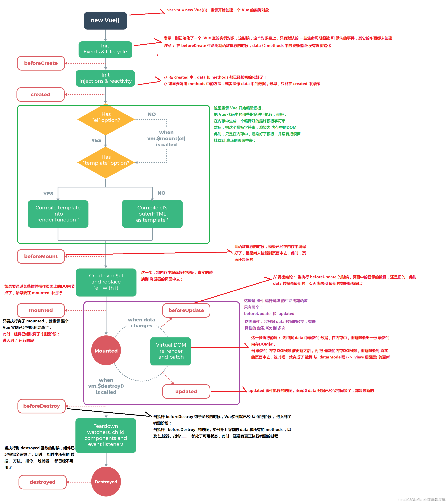

::: tip
生命周期相关专题 训练，无特殊说明，指的都是 Vue2
:::

## Vue 的生命周期(钩子)?

::: info
**<font style="color: red">---------------创建阶段--------------</font>**

1. **beforeCreated**:

实例了`vue`，但还没有进行数据初始化 和 响应式处理

2. **created**:

`vue`实例创建后同步调用，在这一步中，实例已完成对选项的处理，意味着以下内容已被配置完毕：`数据侦听`、`计算属性`、`方法`、`事件/侦听器`的回调函数。然而，挂载阶段还没开始，且 `$el property` 目前尚不可用。

3. **beforeMount**:

`render`函数在这里会被调用，生成`虚拟DOM`, 但是还没有生成真正的`DOM`并替换到`el`上

4. **mounted**:

在这个阶段真实的`DOM`挂载完毕，可以获取到`DOM`。 注意 `mounted` 不会保证所有的子组件也都被挂载完成。如果你希望等到整个视图都渲染完毕再执行某些操作，可以在 `mounted` 内部使用 `vm.$nextTick`

**<font style="color: red">---------------运行阶段--------------</font>**

5. **beforeUpdate**:

数据更新后，新的`虚拟DOM`生成，但还没有和`旧的虚拟DOM`做对比.

6. **update**:

`新旧虚拟DOM`对比后，进行`真实DOM`更新，注意，`updated` 不会保证所有的子组件也都被重新渲染完毕。如果你希望等到整个视图都渲染完毕，可以在 updated 里使用 `vm.$nextTick`

7. **activated**:

被`keep-alive`缓存组件激活时调用

8. **deactivated**:

被`keep-alive`缓存组件停用时调用

**(注：路由注册中设置 keep-alive: true 即缓存的页面没有 9、10 两个销毁生命周期)**

**<font style="color: red">---------------销毁阶段--------------</font>**

9. **beforeDestroy**:

组件实例销毁之前调用，在这里依然能够获取到数据。

10. **destroyed**:

组件实例销毁后调用，对应的所有指令、事件将会被解绑，所有子组件实例也会被销毁

**<font style="color: red">---------------捕获组件错误--------------</font>**

11. **errorCaptured(2.5.0+ 新增)**:

在捕获一个来自后代组件的错误时被调用。此钩子会收到三个参数：错误对象、发生错误的组件实例以及一个包含错误来源信息的字符串。此钩子可以返回 false 以阻止该错误继续向上传播。

> **完整生命周期图，生命周期很重点。完全理解了 vue 的生命周期，就知道运转流程。会规避很多错误。**


:::

## 页面第一次加载会触发那几个生命周期(钩子)?

::: info

> 在路由面试题内，有带有路由版本的答案

会触发 `beforeCreate`, `created`, `beforeMount`, `mounted` 这几个钩子
:::

## DOM 渲染在 哪个周期中完成的？

::: info
**mounted**
:::

## 在哪个生命周期内调用异步请求？

::: info
可以在钩子函数 **created、beforeMount、mounted** 中进行调用，因为在这三个钩子函数中，data 已经创建，可以将服务端端返回的数据进行赋值。

但是推荐在 **<font color="red">created</font>** 钩子函数中调用异步请求，因为在 **<font color="red">created</font>** 钩子函数中调用异步请求有以下优点：

1. 能更快获取到服务端数据，减少页面 loading 时间
2. **SSR** 不支持 **beforeMount**、**mounted** 钩子函数，所以放在 **created** 中有助于一致性

:::

## 在 beforeCreate、created、beforeMount、mounted、beforeUpdate 修改数据会触发 updated 钩子吗？

::: info

- `beforeCreate`是拿不到响应式数据的，可以修改，但没有响应式效果 页面也不会显示修改后的数据，更<font color="red">不会</font>触发 `updated`

- `created`可以拿到`data`中响应式数据，修改后，**页面会更新修改后的数据(首次渲染相当于，在 mounted 挂在后更新的)**, 但<font color="red">不会</font>触发 `updated`

- `beforeMount` 和 created 一样，只不过这一步 仅仅是 虚拟 DOM 创建完毕， <font color="red">不会</font>触发 `updated`

- `mounted` 这时候页面已经挂载完毕，已经可以访问真实 DOM，在这里会修改数据的话， <font color="blue">会</font>触发 `updated`

- `beforeUpdate` 这个钩子发生在更新之前，也就是响应式数据发生更新，虚拟 dom 重新渲染之前被触发，可以在当前阶段进行更改数据，不会造成重渲染, <font color="red">不会</font>触发 `updated`

:::

## 在 updated 中修改数据会怎么样？

::: info
**首先可以确定的是并不会触发死循环。**

要分 2 种情况：

1. 触发 `updated` 钩子之前，修改的数据 和 `updated` 内修改的数据 值保持一致的话，只会触发 **一次** `updated`, vue 内部对响应式处理 有判断，如果两次修改的值 一致的话，直接返回，并不会触发响应式更新。

```js
updated() {
  // updated内，再次 修改数据 值如果和之前一样，则不会触发 updated
  this.msg = 123
},
methods: {
  // 点击clickFn 修改数据 会触发 updated,
  clickFn() {
    this.msg = 123
  }
}
```

2. 触发 `updated` 钩子之前，修改的数据 和 `updated` 内修改的数据 值不同的话，会触发 **两次**

```js
updated() {
  // updated内，修改为 123，则触发 响应式更新，所以再次 进入到 updated视图中，
  // 然后又执行同样的赋值操作，和上次保持一致，不会再触发更新。
  this.msg = 123
},
methods: {
  // 点击clickFn 修改数据 会触发 updated,
  clickFn() {
    this.msg = 456
  }
}
```

:::

## 生命周期钩子可以使用箭头函数吗？

::: info
不可以，在初始化生命周期钩子的时候，会内部会使用`apply` 和 `call` 改变`this`的只想，在箭头函数中`this`指向是无法改变的。
:::

## Vue 父子组件生命周期流程？

::: info

**<font color="red">父子组件的生命周期是一个嵌套的过程。</font>**

**渲染挂载过程：**

> <font color="red">父 beforeCreate</font> -> <font color="red">父 created</font> -> <font color="red">父 beforeMount</font> -> <font color="blue">子 beforeCreate</font> -> <font color="blue">子 created</font> -> <font color="blue">子 beforeMount</font> -> <font color="blue">子 mounted</font> -> <font color="red">父 mounted</font>

**子组件更新过程：**

> <font color="red">父 beforeUpdate</font> -> <font color="blue">子 beforeUpdate</font> -> <font color="blue">子 updated</font> -> <font color="red">父 updated</font>

**父组件更新过程：**

> <font color="red">父 beforeUpdate</font> -> <font color="red">父 updated</font>

**销毁过程：**

> <font color="red">父 beforeDestroy</font> -> <font color="blue">子 beforeDestroy</font> -> <font color="blue">子 destroyed</font> -> <font color="red">父 destroyed</font>

:::

## 父组件可以监听到子组件的生命周期吗？

::: info

1. **子组件`$emit()`触发自定义事件**

```js
// Parent.vue
<Child @mounted="doSomething"/>

// Child.vue
mounted() {
  this.$emit("mounted");
}

```

2. **使用`hook event` 是 Vue 的自定义事件结合生命周期钩子实现的一种从组件外部为组件注入额外生命周期方法的功能。**

```js

//  Parent.vue
<Child @hook:mounted="doSomething" ></Child>

doSomething() {
   console.log('父组件监听到 mounted 钩子函数 ...');
},

//  Child.vue
mounted(){
   console.log('子组件触发 mounted 钩子函数 ...');
},

// 以上输出顺序为：
// 子组件触发 mounted 钩子函数 ...
// 父组件监听到 mounted 钩子函数 ...
```

**@hook 方法不仅仅是可以监听 mounted，其它的生命周期事件，例如：created，updated 等都可以监听。**

:::

## Vue 的 el 属性和$mount 优先级？

::: info
**`el`**的优先级会高，如下会渲染到`app`节点上。

```js
new Vue({
  router,
  store,
  el: "#app",
  render: (h) => h(App),
}).$mount("#ggg");
```

:::

<style>
  /* 这里是 details 块的样式重写  不要切换黑暗模式 */
  /* .custom-block {
    padding: 0 !important;
    font-size: 16px;
  } */
  .custom-block.details {
    background-color: #fff !important;
    padding: 0 !important;
    font-size: 16px;
  }
  .custom-block.details summary {
    color: #3451b2 !important;
  }
</style>
