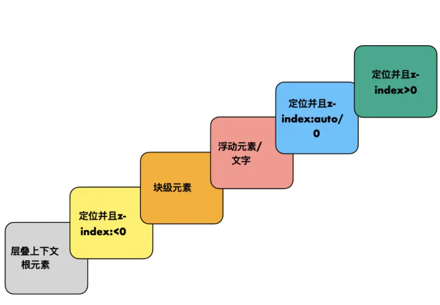

## z-index 大的元素一定在值小的上面吗 ？

z-index 的生效规则：只对指定了 position 属性的元素生效——只要不是默认值 static，其他的 absolute、relative、fixed 都可以使 z-index 生效。还有 flex 的子项目也会生肖。

不一定，要取决于是否在当前层叠上下文。

## 层叠上下文覆盖规律？

## 如何生成层叠上下文？

position 定位 z-index
弹性布局的子项（父元素 display:flex|inline-flex)，并且 z-index 不是 auto 时
opacity 非 1 的元素
transform 非 none 的元素
filter 非 none 的元素

## 如何实现父元素覆盖子元素？？

要实现父元素覆盖子元素，去给父元素设置一个很大的 z-index 是没有用的。因为这样他就成为一个层叠上下文的根元素了，无论子元素被如何设置都会在这个层叠上下文根元素之上。

正确的解法是把子元素的 z-index 设置为负数，这样父元素是一个块级元素，z-index<0 的子元素会在块级元素之下。
