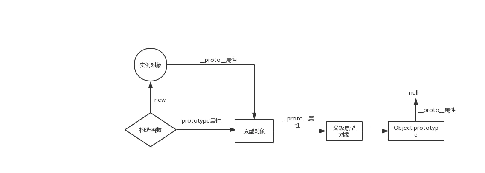
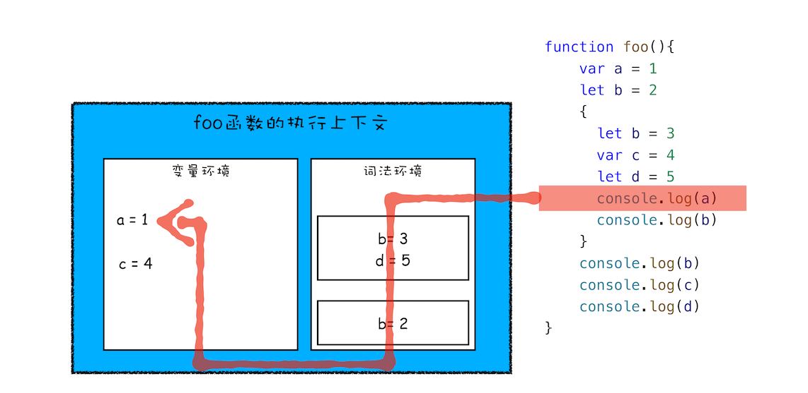

::: tip
这部分大部分都是围绕 JS 基本 API，展开。主要看基本功是否扎实
其中一些底层原理，去看进阶篇。
:::

## JavaScript 概述？

`JavaScript` 是一种基于原型、多范式、单线程的动态解释型编程语言，具备跨平台性。

- **多范式：** 体现在语言支持**命令式编程(传统的面向过程编程)**、**面向对象编程**、**声明式编程(函数式编程)**
- **单线程：** 考虑到客户端多线程会带来操作 `DOM` 的不确定性和复杂性(可以引入锁的概念)，所以 `JS` 是**单线程**的，基于**事件驱动**(事件循环)来实现 `UI` 交互。
- **解释型：** 非编译型语言，边执行边解析代码
- **跨平台：** 可以在浏览器、客户端、移动端等(只要内置可以解释 `JS` 的浏览器，就可以)

## ECMAScript 和 JavaScript 的关系？

`ECMAScript`是国际标准化浏览器脚本语言的标准，浏览器脚本语言不只有`JavaScript`，还有`ActionScript`等。

`JavaScript`编程语言部分是`ECMAScript`的一种实现, 就是我们常说的`ES5`、`ES6+`等规范。而完整的`JavaScript`生态包括**核心语言**、**DOM**、**BOM**等。

## JS 有多少种数据类型？

JS 一共有 8 种数据类型。

**基本数据类型(7 种)：**`String`、`Number`、`Boolean`、`undefined`、`null`、`Symbol`、`BigInt`

**引用数据类型(1 种)：**`Object`

其中`Symbol`是`ES2015`实现的，`BigInt`是 `ES2020`实现的，我们经常使用**对象字面量**、**数组**等都归属于 引用数据类型 `Object`

## Symbol 类型如何声明以及使用场景？

`ES6` 引入了一种新的原始数据类型`Symbol`，表示**独一无二的值**。

`Symbol` 值通过`Symbol()`函数生成,

```js
let a = Symbol();
console.log(a); // 结果：Symbol()

let b = Symbol();
console.log(a === b); // false
```

`Symbol()`函数可以接受一个字符串作为参数，表示对 `Symbol` 实例的描述。这主要是为了在控制台显示，或者转为字符串时，比较容易区分。

```js
let s1 = Symbol("foo");
let s2 = Symbol("bar");

console.log(s1); // Symbol(foo)
console.log(s2); // Symbol(bar)

s1.toString(); // "Symbol(foo)"
s2.toString(); // "Symbol(bar)"

// [!code warning] // Symbol()但参数仅仅是一种描述，参数值相同，得到的两个Symbol类型的值 也是不同的，这就是唯一性
console.log(Symbol("a") === Symbol("a")); // false
```

如果想要使用同一个 `Symbol` 值, 可以使用 `Symbol.for()`

```js
let s1 = Symbol.for("foo");
let s2 = Symbol.for("foo");

console.log(s1 === s2); // true
```

**使用场景 1：作为对象属性名，保证唯一性，防止覆盖和篡改**

```js
let mySymbol = Symbol();

// 第一种写法
let a = {};
a[mySymbol] = 'Hello!';

// 第二种写法
let a = {
  [mySymbol]: 'Hello!'
};

// 第三种写法
let a = {};
Object.defineProperty(a, mySymbol, { value: 'Hello!' });

// 以上写法都得到同样结果
a[mySymbol] // "Hello!"
export a // 导出的对象 外部无论给 对象赋值什么属性，都无法更改 [mySymbol] 属性
```

> **注意：Symbol 值作为属性名，遍历对象的时候，该属性不会出现在 for...in、for...of 循环中，也不会被 Object.keys()、Object.getOwnPropertyNames()、JSON.stringify()返回。有一个 Object.getOwnPropertySymbols()方法，可以获取指定对象的所有 Symbol 属性名。该方法返回一个数组，成员是当前对象的所有用作属性名的 Symbol 值。**

**使用场景 2：消除魔术字符串(经常使用)**

魔术字符串指的是，在代码之中多次出现、与代码形成强耦合的某一个具体的字符串或者数值。风格良好的代码，应该尽量消除魔术字符串，改由含义清晰的变量代替。

```js
function fn(shape)
  switch (shape) {
    case 'rectangle': // 魔术字符串
      // 长方形的逻辑处理。。。
      break;
    case 'circle': // 魔术字符串
      // 圆形的逻辑处理。。。
      brea;
    /* ... more code ... */
  }
fn('rectangle')
fn('circle')
```

以上代码，在实际开发中，具体什么**图形的值**其实我们并不关心，我们只需要知道长方形该做什么、圆形该做什么。所以尽可能使用`Symbol`，如下改造

```js
const rectangle = Symbol();
const circle = Symbol();
function fn(shape)
  switch (shape) {
    case rectangle: // 魔术字符串
      // 长方形的逻辑处理。。。
      break;
    case circle: // 魔术字符串
      // 圆形的逻辑处理。。。
      brea;
    /* ... more code ... */
  }
fn(rectangle)
fn(circle)
```

## Bigint 类型如何声明以及使用场景？

`ES2020` 引入了一种新的数据类型 `BigInt`（大整数），来解决大于 JS 最大数的限制，以及超过最大数后精度问题。

```js
// 超过 53 个二进制位的数值，无法保持精度
Math.pow(2, 53) === Math.pow(2, 53) + 1; // true

// 超过 2 的 1024 次方的数值，无法表示
Math.pow(2, 1024); // Infinity
```

使用`BigInt`后就不用考虑最大值和丢失精度问题了，为了和普通`Number`类型 区分开来，定义的时候结尾使用`n`

```js
const a = 2172141653n;
const b = 15346349309n;

// BigInt 可以保持精度
a * b; // 33334444555566667777n

// 普通整数无法保持精度
Number(a) * Number(b); // 33334444555566670000
```

## JS 的数据类型的检测方式有哪些？

1. **typeof 操作符**

`typeof` 操作符会返回一个字符串(小写字母)，表示类型。

```js
const num = 123;
const str = "abc";
const bool = true;
const arr = [1, 2, 3, 4];
const obj = { name: "larry", age: 18 };
const func = function () {};
const und = undefined;
const nul = null;
const date = new Date();
const reg = /^[a-zA-Z]{5,20}$/;
const error = new Error();

typeof num; // number
typeof str; // string
typeof bool; // boolean
typeof arr; // [!code warning] // object
typeof obj; // [!code warning] // object
typeof func; // function
typeof und; // undefined
typeof nul; // [!code warning] // object
typeof date; // [!code warning] // object
typeof reg; // [!code warning] // object
typeof error; // [!code warning] // object
typeof NaN; // number
typeof 10n; // bigint
typeof Symbol(); // symbol
```

**typeof 能区分的有**

- `number`
- `string`
- `boolean`
- `undefined`
- `function`
- `bigint`
- `symbol`

检测其他类型的时候，都返回 `object`，不太稳定。

2. **instanceof 运算符**
   `instanceof` 运算符用于检测**构造函数**的 `prototype` 属性是否出现在某个实例对象的原型链上(**就是原型链的查找过程**)。

```js
// 定义构造函数
function C() {}
function D() {}

var o = new C();

o instanceof C; // true，因为 Object.getPrototypeOf(o) === C.prototype

o instanceof D; // false，因为 D.prototype 不在 o 的原型链上

o instanceof Object; // true，因为 Object.prototype.isPrototypeOf(o) 返回 true
C.prototype instanceof Object; // true，同上

C.prototype = {};
var o2 = new C();

o2 instanceof C; // true

o instanceof C; // false，C.prototype 指向了一个空对象，这个空对象不在 o 的原型链上。

D.prototype = new C(); // 继承
var o3 = new D();
o3 instanceof D; // true
o3 instanceof C; // true 因为 C.prototype 现在在 o3 的原型链上
```

常见的字符串举例，其他类型暂时不列了

```js
var str1 = "a";
var str2 = new String("a");
var obj = {};

str1 instanceof String; // [!code warning] // 返回 false，非String对象实例，因此返回 false
str1 instanceof Object; // [!code warning] // 返回 false
str2 instanceof String; // 返回 true
str2 instanceof Object; // 返回 true
obj instanceof Object; // [!code warning] // 返回 true obj = {} 相当于 obj = new Object()
```

3. **通过 constructor 构造器属性判断(了解下就好，比较少用)**

```js
// ... 省略部分定义代码

function Person() {}
var Tom = new Person();

Tom.constructor === Person; // true
num.constructor === Number; // true
str.constructor === String; // true
bool.constructor === Boolean; // true
arr.constructor === Array; // true
obj.constructor === Object; // true
func.constructor === Function; // true
date.constructor === Date; // true
reg.constructor === RegExp; // true
error.constructor === Error; // true
```

得到的所有结果都是 true，除了 `undefined` 和 `null`，其他类型基本可以通过 `constructor` 判断。

不过因为 `constructor` 的属性是可以被修改的，可能导致检测出的结果不正确。

4. **Object.prototype.toString.call() 完美结局方案**

```js
// ... 省略部分定义代码
Object.prototype.toString.call(num); // [object Number]
Object.prototype.toString.call(str); // [object String]
Object.prototype.toString.call(bool); // [object Boolean]
Object.prototype.toString.call(arr); // [object Array]
Object.prototype.toString.call(json); // [object Object]
Object.prototype.toString.call(func); // [object Function]
Object.prototype.toString.call(und); // [object Undefined]
Object.prototype.toString.call(nul); // [object Null]
Object.prototype.toString.call(date); // [object Date]
Object.prototype.toString.call(reg); // [object RegExp]
Object.prototype.toString.call(error); // [object Error]
Object.prototype.toString.call(Symbol()); // [object Symbol]
Object.prototype.toString.call(10n); // [object BigInt]
```

> **只需要将它的结果 `result.slice(8, -1)` 就能得到具体的类型。**

## JS 判断是否是数组？

前面提过

1. instanceof
2. construct
3. Object.prototype.toString.call()
4. Array.isArray() ES6 之后

```js
Array.isArray([]); // true
```

## null 和 undefined 的区别？

**null 表示"没有对象"，即该处不应该有值** 典型用法是：

1. 引用类型变量初始化、手动清除对象引用等。

```js
let obj = null;
```

2. 作为对象原型链的终点。

```js
Object.getPrototypeOf(Object.prototype); // null
```

**undefined 表示"缺少值"，就是此处应该有一个值，但是还没有定义** 典型用法是：

1. 变量被声明了，但没有赋值时，就等于 `undefined。`
2. 调用函数时，应该提供的参数没有提供，该参数等于 `undefined。`
3. 对象没有赋值的属性，该属性的值为 `undefined。`
4. 函数没有返回值时，默认返回 `undefined。`

```js
var i;
i; // undefined

function f(x) {
  console.log(x); // undefined
}
f();

var o = new Object();
o.p; // undefined

var x = f();
x; // undefined
```

## JS 有哪些包装类型或者说什么叫做装箱、拆箱？

包装类型是特殊的引用类型，具有与基本数据类型对应的引用类型的**属性和方法**。当基本数据类型以对象的方式使用时，`js`会转换为对应的**包装类型(这个过程叫做装箱)**，反之称之为(拆箱)。

```js
var str = "test";
str.length; // [!code warning] // 这里隐式进行装箱，可以使用String原型上的属性
str.charAt(1); // [!code warning] // 使用方法

var str2 = String("test"); // [!code warning] // 使用String包装类进行 显示装箱
```

经过装箱后的变量变成**包装类型**后，和**引用类型**(就是使用 new 创建的引用对象)的主要区别在于，**生命周期**不同

```js
var str = "test"; // 基本类型(隐式包装后)
str.propA = "aaa";
console.log(str.propA); // [!code warning] // undefined

var str2 = new String("test2"); // 引用类型
str2.propA = "bbb";
console.log(str2.propA); // [!code warning] // 'bbb'
```

> **以上同样适用于 Number 和 Boolean**

## == 和 === 的区别?

`==` 是判断**值**相等，`===` 是判断**值(引用类型下值为 引用地址) + 类型** 是否都相等。

```js
var str1 = "123";
var str2 = "123";
var str3 = new String("123");
var str4 = new String("123");
var str5 = str4;

// [!code warning] 两个基本类型只要是值相等，无论 == 还是 === 永远都为true
str1 == str2; // true
str1 === str2; // true

// [!code warning] 基本类型和引用类型只要是值相等，== 永远都为true
str1 == str3; // true

// [!code warning] 基本类型和引用类型 === 永远都为false
str1 === str3; // false

// [!code warning] 两个没有指向同一块堆内存的 引用类型 无论 ==  还是 === 永远都为false
str3 == str4; // false
str3 === str4; // false

// [!code warning] 两个指向同一块堆内存的 引用类型 无论 ==  还是 === 永远都为true
str4 == str5; // true
str4 === str5; // true
```

> **不同类型之间比较，这里就不说了，== 比较隐式转换后的值是否相等，=== 类型不相等 就为 false 了**

## Object.is() 和 === 的区别？

ES6 的新方法，它用来比较两个值是否严格相等，与严格比较运算符（===）的行为基本一致。

不同之处只有两个：**一是+0 不等于-0**，**二是 NaN 等于自身**。

```js
+0 === -0; //true
NaN === NaN; // false

Object.is(+0, -0); // false
Object.is(NaN, NaN); // true
```

## JS 有哪些遍历方式?

`for循环`：循环是最基本的遍历方式，适用于所有情况，但代码较为繁琐。

`forEach`：方法是数组、Map、Set 等专用的遍历方法，代码简洁，但无法使用`break`和`continue`跳出循环。

`for..of`：循环适用于遍历**可迭代对象**，如`数组`、`字符串`、`Map`、`Set`等，语法简单，但无法获取索引。

`for..in`：循环适用于遍历**对象的属性**，但会遍历原型链上的属性。也可以遍历数组，每一项是索引。

`Object.keys`：方法结合`forEach`方法适用于遍历对象的属性，不遍历原型链。

`Object.entries`：方法结合`forEach`方法适用于遍历对象的键值对。

## ES6+都增加了哪些新特性?

一般列出来的，都必须要掌握使用过的，后面面试题会陆续展开每个 API 的特性、原理、使用场景等。

- 基础：**let、const**、**解构赋值**、**运算符扩展**等
- 字符串：**增加模板字符串**等
- 函数：**箭头函数**、**增加函数默认值**、**rest 参数**等
- 对象：**属性、方法简化写法**、**属性名表达式**等
- 新增(基础): **ES Module**、**Symbol(数据类型)**、**BigInt(数据类型)**、**Set、Map 数据结构**、**Class 语法糖**
- 新增(进阶): **Proxy**、**Reflect**、**Iterator(遍历器接口) for..of**
- 新增(重点): **Promise**、**Generator**、**async 函数**

## var/let/const 区别？

- `var`:

  1. `var`可以重复声明变量
  2. 作用域：全局作用域和函数作用域
  3. `var`支持变量提升
  4. 全局作用域下声明的变量会成为`window`对象的属性

- `let`:

  1. 同一作用域下不能重复声明变量
  2. 作用域：全局作用域 和 块级作用域
  3. 不支持变量提升
  4. 存在暂时性死区

- `const`:
  1. `let` 有的它也有
  2. 初始化必须赋值
  3. 赋值后不能改变

## 如何彻底冻结一个对象(无法修改其内部属性)？

> 不能修改被 const 修饰的普通数据类型，对象的话引用地址也是修改不了的。但是可以修改对象内部的属性。可以使用`Object.freeze(被冻结对象)`进行对对象的属性冻结。完全彻底冻结的话如下写法：

```js
var constantize = (obj) => {
  Object.freeze(obj); // 冻结对象
  // 遍历对象，如果属性依然是 对象，则递归处理。
  Object.keys(obj).forEach((key, i) => {
    if (typeof obj[key] === "object") {
      // 递归
      constantize(obj[key]);
    }
  });
};
```

## 函数作用域和块级作用域？

- **函数作用域**：在 JavaScript 中定义一个函数，函数内部的变量只能通过函数内部访问，同时它可以**修改**和**影响外部变量**。
- **块级作用域**：变量在离开定义的块级代码后立即被回收，存在**暂时性死区**的特性。

在 `ES5` 中只有**全局作用域**和**函数作用域**，**没有块级作用域**，这会带来些许麻烦：

1. 内层变量覆盖外层变量

```js
var tmp = new Date();

function f() {
  // [!code highlight] // 变量提升 所以 是 undefined， 如果用let 就直接会 报错，暂时性死区。
  console.log(tmp);
  if (false) {
    var tmp = "hello";
  }
}

f(); // undefined
```

2. 循环的变量泄露为全局变量

```js
for (var i = 0; i < 3; i++) {}
console.log(i); // 3
```

`ES6`新增了块级作用域：块语句用于组合零个或者多个语句，这个块由一对大括号 `{}` 界定。

```js
{
  let x = 1; // 或者 const x = 1;
}
```

`ES5`可以用以下方式实现：

```js
(function () {})();
```

## 什么是暂时性死区？

只要块级作用域内存在 `let/const` 命令，它所声明的变量就绑定这个区域，不再受外部的影响。
在代码块内，使用 `let/const` 声明变量之前，该变量都是不可用的，所以叫 “`暂时性死区`”。

```js
var tmp = 123;

if (true) {
  tmp = "abc"; // [!code error] // ReferenceError
  let tmp;
}
```

## 什么是变量提升和函数提升？

**变量提升**

```js
console.log(a); // undefined

var a = 10;
```

看上面代码，在 JavaScript 解析的过程中，会将 `a` 提取到上面进行声明。

而 `console.log(a)` 打印的时候，因为 `a` 声明了但是没有填写值，所以是 `undefined`。

其实`变量提升`是 JS 的设计的一个缺陷，所以后来引入了 `let/const`，来避免变量提升带来的问题。

```js
var a;

console.log(a);

a = 10;
```

而这段代码换成 `let` 或者 `const` 语句呢？就会出现 `暂时性死区`。

```js
console.log(a);

let a = 10;
// [!code error] // VM196:1 Uncaught ReferenceError: Cannot access 'a' before initialization
```

**函数提升**

```js
var foo = 3;

function getFoo() {
  var foo = foo || 5;
  console.log(foo); // [!code highlight] // 输出 5
}

getFoo();
```

**记住一句话：函数是一等公民**，函数提升，会解析成下边的代码：

```js
function getFoo() {
  var foo;
  foo = foo || 5;
  console.log(foo);
}

var foo;
foo = 3;

getFoo();
```

**总结：函数提升优先级 > 变量提升优先级**

## 箭头函数和普通函数的区别？

1. **this 指向**：

箭头函数没有自己的`this`，它会捕获所在上下文的`this`值。

而普通函数的`this`是在运行时确定的，根据调用方式决定。

```js
// 普通函数中的this指向调用者
function greet() {
  console.log(`Hello, ${this.name}!`);
}

const person = { name: "Alice" };

greet.call(person); // 输出：Hello, Alice!

// 箭头函数中的this指向定义时的上下文
const greetArrow = () => {
  console.log(`Hello, ${this.name}!`);
};

greetArrow.call(person); // 输出：Hello, undefined!
```

2. **不可作为构造函数**：

箭头函数不能使用`new`关键字来创建实例，它没有自己的`prototype`属性，无法进行实例化。

```js
const Person = (name) => {
  this.name = name; // [!code error] // 错误，箭头函数不能作为构造函数
};

const person = new Person("Alice"); // 错误，无法实例化箭头函数
```

3. **无 arguments 对象**：

箭头函数没有自己的`arguments`对象，可以使用`Rest`参数来代替。

```js
function sum() {
  console.log(arguments); // 输出函数的参数列表
}

sum(1, 2, 3); // 输出：Arguments(3) [1, 2, 3]

const sumArrow = (...args) => {
  console.log(args); // 输出函数的参数列表
};

sumArrow(1, 2, 3); // 输出：[1, 2, 3]
```

4. **无 yield 命令**：

箭头函数不能用作**Generator**函数，无法使用`yield`命令进行函数的暂停和恢复。

```js
function* generatorFunc() {
  yield 1;
  yield 2;
}

const gen = generatorFunc();
console.log(gen.next().value); // 输出：1

const arrowGen = () => {
  yield 1; // 错误，箭头函数不能使用yield命令
};
```

## JS 中的数组和函数在内存中是如何存储的？

JS 中的数组存储大致需要分为两种情况：

- 同种类型数据的数组分配 **连续** 的内存空间
- 存在非同种类型数据的数组使用 **哈希映射** 分配内存空间

## 谈谈 this 的使用？

**在全局环境中**

this 指向全局对象（在浏览器环境中通常是 **window** 对象, node 环境是 **global**）。

```js
// 在浏览器中， window 对象同时也是全局对象
conosle.log(this === window); // true

a = "apple";
conosle.log(window.a); // apple

this.b = "banana";
console.log(window.b); // banana
console.log(b); // banana
```

**在函数中，this 的值取决于函数的调用方式**

- 如果函数是作为对象的方法调用，this 指向调用该方法的对象。

```js
let obj1 = {
  name: "liu",
  say: function () {
    console.log(this);
  },
};
obj1.say(); // {name: 'liu', say: ƒ}
```

- 如果函数是作为普通函数调用，this 指向全局对象（非严格模式下）或 undefined（严格模式下）。

```js
function fn(num) {
  this.num = num; // 普通函数调用，this指向window（非严格模式下）
}
fn(22); // 普通函数调用

console.log(window.num); // 22
```

- 如果函数是作为构造函数调用（使用 new 关键字），this 指向新创建的对象实例。

```js
function Person() {
  this.name = name;
}
let p = new Person();
```

- 如果函数是通过 `Function.prototype` 上的 `call/apply/bind` 可以改变 this 指向，this 指向 call、apply 或 bind 方法的第一个参数所指定的对象。

```js
function say() {
  console.log("age: ", this.age);
}

let obj1 = {
  age: 18,
};

let obj2 = {
  age: 22,
};

say.call(obj1); // 18 此时say中的this指向 obj1
say.call(obj2); // 22 此时say中的this指向 obj1
```

- 在箭头函数中，this 的值是继承自外部作用域的，它不会因为调用方式的改变而改变。

```js
let btn = document.createElement("button");
btn.addEventListener("click", function () {
  console.log("click fn", this); // <button></button>
  setTimeout(function () {
    console.log("普通函数：", this); // window, 此时 this指向 window（非严格模式）
  }, 1000);
  setTimeout(() => {
    console.log("箭头函数：", this); // <button></button> 此时 this 指向 外部作用域，就是 button
  }, 1000);
});
btn.click();
```

## 谈谈原型和原型链？

在 JS 中，每当定义一个函数数据类型(普通函数、类)时候，都会自带一个`prototype`属性，这个属性指向函数的**原型对象（显示原型）**。

在使用`new 构造函数` 创建某个类型的实例后，这个实例的 `__proto__`（隐式原型），隐式原型是一个私有的对象属性，不可操作。

显示原型和隐式原型的关系：

```js
let arr = []; // 相当于 let arr = new Array()
arr.__proto__ === Array.prototype;

{}.__proto__ === Object.prototype;
```

我们可以使用数组、字符串等的方法，其实就是在使用其原型对象上的方法

```js
let arr = [];
let str = new String();

// arr.push() Array.prototype.push
// str.substr() String.prototype.substr
```

也可以扩展公用方法(不推荐扩展 JS 原生类型)，例如：

```js
// 所有数组将拥有max方法
Array.prototype.max = function(){return Math.max(...this))}
// 所有字符串将拥有 reverse 方法
String.prototype.reverse = function(){return this.split("").reverse().join("")}

// 自定义构造函数
function Person() {
  this.name = 'xxx'
}
// 使用原型扩展其 实例方法（所有Person类型实例，都可以使用say方法）
Person.prototype.say = function() { console.log(this.name) }

// ES6 的类 本质上就是构造函数
class Person {
  constructor() {
    this.name = 'xxx'
  }
  say() { // 等同于 Person.prototype.say
    console.log(this.name)
  }
}
```

**原型链：** JS 继承是基于原型的，原型的意义就在于可以共享原型属性和方法，我们使用某个类型实例的一些方法，其实是在使用它原型上（或原型的原型。。以此类推就形成了**原型链**）`Objec.prototype` 是原型链的最顶端， `Objec.prototype.__proto__` 为 `null` 如果查不到要使用的方法，那说明整个原型链上都没有定义该方法。



**相关常用 API：**

`Object.create()`： 静态方法以一个现有对象作为原型，创建一个新对象。

`Object.getPrototypeOf()`：静态方法返回指定对象的原型（即内部 `[[Prototype]]` 属性的值）

`Object.prototype.hasOwnProperty()`：返回一个布尔值，表示对象自有属性（而不是继承来的属性）中是否具有指定的属性。

## prototype、`__proto__`、构造函数的关系？

- `构造函数.prototype === 实例.__proto__ === 原型`
- `原型.constructor === 实例.constructor === 实例.__proto__.constructor === 构造函数`

上边`实例.constructor `其实访问的就是 实例原型上的`constructor`属性

```js
let p = new Person();
Person.prototype === p.__proto__; // true
p.constructor === Person; // true
p.__proto__.constructor === Person; // true
Person.prototype.constructor === Person; // true
```

## new 操作符具体做了什么?

在调用 new 的过程中做了四件事：

1. **新生成对象：** new 关键字会首先创建一个空对象
2. **链接到原型：** 从而继承原型上的方法
3. **绑定 this：** 将 this 指向这个空对象，执行构造函数中的代码，以获取私有属性
4. **返回新对象：** 如果构造函数返回了一个对象 res，就将该返回值 res 返回，如果返回值不是对象，就将创建的对象返回

## 什么是 JS 的执行上下文？

**执行上下文**就是当前 `JavaScript` 代码被 **解析** 和 **执行** 时`所在环境的抽象概念`， `JavaScript` 中运行任何的代码都是在**执行上下文**中运行。

> **执行上下文的类型：**

- **全局执行上下文：** 这是默认的、最基础的执行上下文。不在任何函数中的代码都位于全局执行上下文中。它做了两件事：

  1.  创建一个全局对象，在浏览器中这个全局对象就是 window 对象。
  2.  将 this 指针指向这个全局对象。一个程序中只能存在一个全局执行上下文。

- **函数执行上下文：** 每次调用函数时，都会为该函数创建一个新的执行上下文。每个函数都拥有自己的执行上下文，但是只有在函数被调用的时候才会被创建。一个程序中可以存在任意数量的函数执行上下文。每当一个新的执行上下文被创建，它都会按照特定的顺序执行一系列步骤，具体过程将在本文后面讨论。

- **Eval 函数执行上下文：** 运行在 eval 函数中的代码也获得了自己的执行上下文，但由于 Javascript 开发人员不常用 eval 函数，所以在这里不再讨论。

## 执行上下文内结构？

js 在编译过程中，生成对应的执行上下文。其中包括**变量环境**、**词法环境**、**this**、**外部环境**

**变量环境**： 主要是`var` `变量提升`、`函数`的声明等，

**词法环境**：是 `let`、`const` 等声明的位置。



## 什么是词法作用域？

**词法作用域** 就是指作用域是由代码中函数声明的位置来决定的，所以词法作用域也叫**静态的作用域**，通过它就能够预测代码在执行过程中如何查找标识符。

## 谈谈 作用域 和 作用域链？

**<font color="blue">作用域</font>**

作用域就是变量与函数的可访问范围，即作用域控制着变量和函数的可见性和生命周期。

作用域分为：

- **全局作用域** 中的变量在代码中的任何地方都能访问，其生命周期伴随着页面的生命周期。

- **函数作用域** 就是在函数内部定义的变量或者函数，并且定义的变量或者函数只能在函数内部被访问。函数执行结束之后，函数内部定义的变量会被销毁。

- **块级作用域 (es6)**

```js
//if块
if(1){}

//while块
while(1){}

//函数块
function foo(){

//for循环块
for(let i = 0; i<100; i++){}

//单独一个块
{}
```

**<font color="blue">作用域链(重点)</font>**

**作用域链** 是一种用于查找变量和函数的机制，它是由当 **前执行环境** 和 **其所有父级执行环境** 的 **变量对象** 组成的链式结构。当在一个执行环境中访问变量或函数时，会首先在当前执行环境的变量对象中查找，如果找不到，则会沿着作用域链向上查找，直到找到对应的变量或函数，或者达到最外层的全局对象（如 `window`）。

作用域链的创建是在函数定义时确定的，它与函数的定义位置有关。当函数被调用时，会创建一个新的执行环境，其中包含一个新的变量对象，并将其添加到作用域链的前端。这样，函数内部就可以访问其所在作用域以及其外部作用域中的变量和函数，形成了一个作用域链。

作用域链并不是由 上下文执行栈或者说作用域 决定的，而是由 **<font color="red">词法作用域</font>** 决定的。

例如：

```js
function bar() {
  console.log(myName);
}
function foo() {
  var myName = "a";
  bar();
}
var myName = "b";
foo(); // 打印 b
```

```js
function bar() {
  var myName = " 极客世界 ";
  let test1 = 100;
  if (1) {
    let myName = "Chrome 浏览器 ";
    console.log(test);
  }
}
function foo() {
  var myName = " 极客邦 ";
  let test = 2;
  {
    let test = 3;
    bar();
  }
}
var myName = " 极客时间 ";
let myAge = 10;
let test = 1;
foo();
```


## 什么是闭包？

在 JavaScript 中，根据 **作用域链** 的规则，内部函数总是可以访问其外部函数中声明的变量，当通过调用一个外部函数后，即使该外部函数已经执行结束了，但是内部函数**引用外部函数的变量依然保存在内存中**，这些变量的集合称为 **闭包**。

**优点：**私 有的方法和变量，防止全局污染。

**缺点：** 闭包会常驻内存，会增大内存使用量，使用不当很容易造成内存泄露。如果该闭包会一直使用，那么它可以作为全局变量而存在。（页面关闭后才会被销毁），但如果使用频率不高，而且占用内存又比较大的话，那就尽量让它成为一个局部变量。（如果引用闭包的函数是个局部变量，等函数销毁后，在下次 JavaScript 引擎执行垃圾回收时，判断闭包这块内容如果已经不再被使用了，那么 JavaScript 引擎的垃圾回收器就会回收这块内存

**使用场景：**

1. 防抖截流

```js
// 防抖
function debounce(fn, delay = 300) {
  let timer; //闭包引用的外界变量
  return function () {
    const args = arguments;
    if (timer) {
      clearTimeout(timer);
    }
    timer = setTimeout(() => {
      fn.apply(this, args);
    }, delay);
  };
}
```

2. 封装私有变量、方法

```js
var Counter = (function () {
  var privateCounter = 0;
  function changeBy(val) {
    privateCounter += val;
  }
  return {
    increment: function () {
      changeBy(1);
    },
    decrement: function () {
      changeBy(-1);
    },
    value: function () {
      return privateCounter;
    },
  };
})();

console.log(Counter.value()); /* logs 0 */
Counter.increment();
Counter.increment();
console.log(Counter.value()); /* logs 2 */
Counter.decrement();
console.log(Counter.value()); /* logs 1 */
```

## JS 继承？

太多了，ES5 写一种就行了，组合式继承（构造函数 + 原型），既继承了父构造函数的属性，又继承了父构造函数原型对象上的方法。

```js
// 父
function Parent(name) {
  this.name = name;
}
Parent.prototype.sayHello = function () {
  console.log("Hello");
};

// 子
function Child(name) {
  // 继承 父构造函数 属性
  Parent.call(this, name);
}

// 原型指向 父实例
Child.prototype = new Parent();
Child.prototype.constructor = Child;

var child = new Child("Child");
child.sayHello(); // Hello
```

## Object.defineProperty 有哪几个参数？各自都有什么作用？

`Object.defineProperty` 在一个对象上定义一个新属性，或修改其现有属性，并返回此对象。

语法：`Object.defineProperty(obj, prop, descriptor)`

**obj：**要定义属性的对象。

**prop：** 一个字符串或 Symbol，指定了要定义或修改的属性键。

**descriptor：** 要定义或修改的属性的描述符。

关于描述符，看 [MDN Object.defineProperty](https://developer.mozilla.org/zh-CN/docs/Web/JavaScript/Reference/Global_Objects/Object/defineProperty)

## ES6 的 proxy 的用法？

Proxy 可以理解成，在目标对象之前架设一层“拦截”，外界对该对象的访问，都必须先通过这层拦截，因此提供了一种机制，可以对外界的访问进行过滤和改写。

语法：`var proxy = new Proxy(target, handler);` `target`为拦截的对象，`handler`拦截行为

```js
var obj = new Proxy(
  {},
  {
    get: function (target, propKey, receiver) {
      console.log(`getting ${propKey}!`);
      return Reflect.get(target, propKey, receiver);
    },
    set: function (target, propKey, value, receiver) {
      console.log(`setting ${propKey}!`);
      return Reflect.set(target, propKey, value, receiver);
    },
  }
);

obj.count = 1;
//  setting count!
++obj.count;
//  getting count!
//  setting count!
//  2
```

**Proxy 支持的拦截操作一览，一共 13 种** [参考 ES6 proxy](https://es6.ruanyifeng.com/#docs/proxy)

## ES6 Reflect 的用法？

- 将 Object 对象的一些明显属于语言内部的方法（比如 Object.defineProperty），放到 Reflect 对象上。
- 修改某些 Object 方法的返回结果，让其变得更合理。
- 让 Object 操作都变成函数行为。某些 Object 操作是命令式
- Reflect 对象的方法与 Proxy 对象的方法一一对应，只要是 Proxy 对象的方法，就能在 Reflect 对象上找到对应的方法。

[参考 ES6 Reflect](https://es6.ruanyifeng.com/#docs/reflect)

## ES6 的 promise 的用法？

**Promise** 是异步编程的一种解决方案，比传统的解决方案——回调函数和事件——更合理和更强大. 有了 Promise 对象，就可以将异步操作以同步操作的流程表达出来，避免了层层嵌套的回调函数。

**<font color="blue">特点：</font>**

1. 有三种状态：`pending`（进行中）、`fulfilled`（已成功）和 `rejected`（已失败），只有异步操作的结果，可以决定当前是哪一种状态，任何其他操作都无法改变这个状态。

2. 一旦状态改变，就不会再变，任何时候都可以得到这个结果。Promise 对象的状态改变，只有两种可能：从`pending`变为`fulfilled`和从`pending`变为`rejected`。

**<font color="red">缺点：</font>**

1. 无法取消 promise，一旦创建无法中途取消。

2. 如果不设置回调函数，外部无法捕获其内部的错误。

3. 当处于 pending 状态时，无法得知目前进展到哪一个阶段（刚刚开始还是即将完成）。

基本用法：

```js
const promise = new Promise(function(resolve, reject) {
  // ... some code

  if (/* 异步操作成功 */){
    resolve(value);
  } else {
    reject(error);
  }
});

promise.then(function(value) {
  // success
}, function(error) {
  // failure
});
```

Promise 新建后就会立即执行:

```js
let promise = new Promise(function (resolve, reject) {
  console.log("Promise");
  resolve();
});

promise.then(function () {
  console.log("resolved.");
});

console.log("Hi!");

// Promise
// Hi!
// resolved
```

**实现 promise A+ 规范，是面试重点。去参考手写代码里 promise A+ 实现**

**事件循环宏任务和微任务的执行顺序也是面试重点**

## Promise.resolve()方法?

[阮一峰 Promise.resolve()](https://es6.ruanyifeng.com/#docs/promise#Promise-resolve)

## Promise.reject()方法?

[阮一峰 Promise.reject()](https://es6.ruanyifeng.com/#docs/promise#Promise-reject)

## Promise.all()方法?

[阮一峰 Promise.all()](https://es6.ruanyifeng.com/#docs/promise#Promise-all)

## Promise.race()方法？

[阮一峰 Promise.race()](https://es6.ruanyifeng.com/#docs/promise#Promise-race)

## Promise.allSettled() 方法？

[阮一峰 Promise.allSettled()](https://es6.ruanyifeng.com/#docs/promise#Promise-allSettled)

## Promise.any() 方法？

[阮一峰 Promise.any()](https://es6.ruanyifeng.com/#docs/promise#Promise-any)

## Promise.try() 方法？

[阮一峰 Promise.try()](https://es6.ruanyifeng.com/#docs/promise#Promise-try)

## async/await ?

[阮一峰 async](https://es6.ruanyifeng.com/#docs/async)
