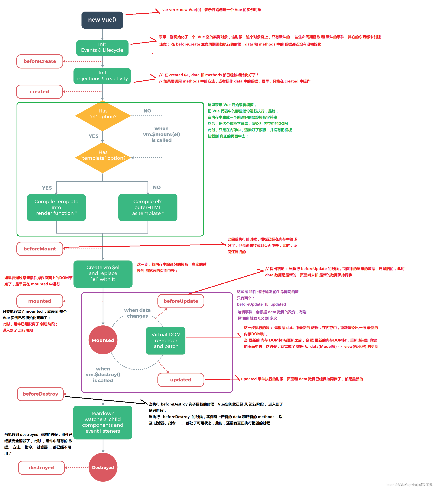

::: tip
生命周期相关专题 训练
:::

## Vue 的生命周期(又称为钩子)?

::: details
**<font style="color: red">---------------创建阶段--------------</font>**

1. **beforeCreated**:

实例了`vue`，但还没有进行数据初始化 和 响应式处理

2. **created**:

`vue`实例创建后同步调用，在这一步中，实例已完成对选项的处理，意味着以下内容已被配置完毕：`数据侦听`、`计算属性`、`方法`、`事件/侦听器`的回调函数。然而，挂载阶段还没开始，且 `$el property` 目前尚不可用。

3. **beforeMount**:

`render`函数在这里会被调用，生成`虚拟DOM`, 但是还没有生成真正的`DOM`并替换到`el`上

4. **mounted**:

在这个阶段真实的`DOM`挂载完毕，可以获取到`DOM`。 注意 `mounted` 不会保证所有的子组件也都被挂载完成。如果你希望等到整个视图都渲染完毕再执行某些操作，可以在 `mounted` 内部使用 `vm.$nextTick`

**<font style="color: red">---------------运行阶段--------------</font>**

5. **beforeUpdate**:

数据更新后，新的`虚拟DOM`生成，但还没有和`旧的虚拟DOM`做对比.

6. **update**:

`新旧虚拟DOM`对比后，进行`真实DOM`更新，注意，`updated` 不会保证所有的子组件也都被重新渲染完毕。如果你希望等到整个视图都渲染完毕，可以在 updated 里使用 `vm.$nextTick`

7. **activated**:

被`keep-alive`缓存组件激活时调用

8. **deactivated**:

被`keep-alive`缓存组件停用时调用

**<font style="color: red">---------------销毁阶段--------------</font>**

9. **beforeDestroy**:

组件实例销毁之前调用，在这里依然能够获取到数据。

10. **destroyed**:

组件实例销毁后调用，对应的所有指令、事件将会被解绑，所有子组件实例也会被销毁

**<font style="color: red">---------------捕获组件错误--------------</font>**

11. **errorCaptured(2.5.0+ 新增)**:

在捕获一个来自后代组件的错误时被调用。此钩子会收到三个参数：错误对象、发生错误的组件实例以及一个包含错误来源信息的字符串。此钩子可以返回 false 以阻止该错误继续向上传播。

> **完整生命周期图，生命周期很重点。完全理解了 vue 的生命周期，就知道运转流程。会规避很多错误。**


:::

## 页面第一次加载会触发那几个生命周期(钩子)?

::: details
会触发 `beforeCreate`, `created`, `beforeMount`, `mounted` 这几个钩子
:::

## DOM 渲染在 哪个周期中完成的？

::: details
**mounted**
:::

## 在哪个生命周期内调用异步请求？

::: details
可以在钩子函数 **created、beforeMount、mounted** 中进行调用，因为在这三个钩子函数中，data 已经创建，可以将服务端端返回的数据进行赋值。

但是推荐在 **<font color="red">created</font>** 钩子函数中调用异步请求，因为在 **<font color="red">created</font>** 钩子函数中调用异步请求有以下优点：

1. 能更快获取到服务端数据，减少页面 loading 时间
2. **SSR** 不支持 **beforeMount**、**mounted** 钩子函数，所以放在 **created** 中有助于一致性

:::

## Vue 父子组件生命周期流程？

::: details

**<font color="red">父子组件的生命周期是一个嵌套的过程。</font>**

**渲染挂载过程：**

> <font color="red">父 beforeCreate</font> -> <font color="red">父 created</font> -> <font color="red">父 beforeMount</font> -> <font color="blue">子 beforeCreate</font> -> <font color="blue">子 created</font> -> <font color="font">子 beforeMount</font> -> <font color="blue">子 mounted</font> -> <font color="red">父 mounted</font>

**子组件更新过程：**

> <font color="red">父 beforeUpdate</font> -> <font color="blue">子 beforeUpdate</font> -> <font color="blue">子 updated</font> -> <font color="red">父 updated</font>

**父组件更新过程：**

> <font color="red">父 beforeUpdate</font> -> <font color="red">父 updated</font>

**销毁过程：**

> <font color="red">父 beforeDestroy</font> -> <font color="blue">子 beforeDestroy</font> -> <font color="blue">子 destroyed</font> -> <font color="red">父 destroyed</font>

:::

## 父组件可以监听到子组件的生命周期吗？

::: details

1. **子组件`$emit()`触发自定义事件**

```js
// Parent.vue
<Child @mounted="doSomething"/>

// Child.vue
mounted() {
  this.$emit("mounted");
}

```

2. **使用`hook event` 是 Vue 的自定义事件结合生命周期钩子实现的一种从组件外部为组件注入额外生命周期方法的功能。**

```js

//  Parent.vue
<Child @hook:mounted="doSomething" ></Child>

doSomething() {
   console.log('父组件监听到 mounted 钩子函数 ...');
},

//  Child.vue
mounted(){
   console.log('子组件触发 mounted 钩子函数 ...');
},

// 以上输出顺序为：
// 子组件触发 mounted 钩子函数 ...
// 父组件监听到 mounted 钩子函数 ...
```

**@hook 方法不仅仅是可以监听 mounted，其它的生命周期事件，例如：created，updated 等都可以监听。**

:::

## Vue 的 el 属性和$mount 优先级？

::: details
**`el`**的优先级会高，如下会渲染到`app`节点上。

```js
new Vue({
  router,
  store,
  el: "#app",
  render: (h) => h(App)
}).$mount("#ggg")
```

:::

<style>
  /* 这里是 details 块的样式重写  不要切换黑暗模式 */
  /* .custom-block {
    padding: 0 !important;
    font-size: 16px;
  } */
  .custom-block.details {
    background-color: #fff !important;
    padding: 0 !important;
    font-size: 16px;
  }
  .custom-block.details summary {
    color: #3451b2 !important;
  }
</style>
